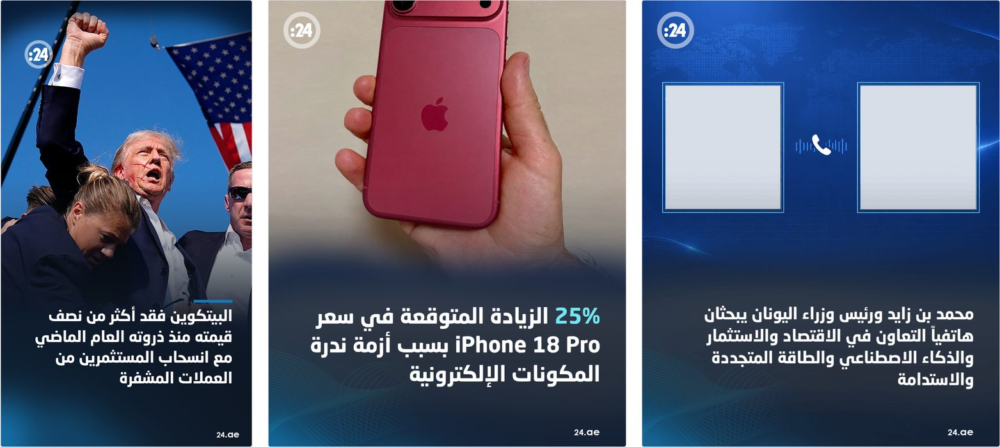

# محرر تصاميم البطاقات

A lightweight, static web tool for editing "24.ae"-style news card designs — swap
photos, edit headlines, and download a finished PNG — without ever opening
Photoshop. Built for a design team to hand off card creation to anyone,
directly from the browser.



## Why this exists

The original designs are Photoshop `.psd` files with a custom Arabic font and
several layered effects (gradients, blend modes, logo watermark). Every
`.psd` was converted into a browser-native template — background/photo(s),
font, colors, and text-box geometry all faithfully reproduced with an HTML
`<canvas>` — so a non-designer can produce an on-brand image in seconds.

## ✨ Features

- **3 ready-made templates** — see below.
- **Drag, zoom & reset** any photo directly on the live preview.
- **Live headline editing** with automatic word-wrap and font-size shrink-to-fit.
- **Optional colored highlight** for any word or number in the headline —
  matches wherever it appears (start, middle, or end), even if it happens to
  span across two wrapped lines.
- **One-click PNG export** at full design resolution.
- **No backend, no build step, no dependencies** — pure HTML/CSS/JS. Works
  fully offline once loaded, and the whole app is under 2 MB.
- **Fast on mobile** — no frameworks, no external fonts loaded over the
  network beyond the one custom font file.

## 🖼️ Templates

| Template | Canvas size | What's editable |
|---|---|---|
| **ستوري** | 1080 × 1920 | Background photo (drag/zoom), headline, optional highlight |
| **بطاقة** | 1080 × 1350 | Background photo (drag/zoom), headline, optional highlight |
| **اتصالات** | 1080 × 1350 | Two independent photo slots (drag/zoom each), headline, optional highlight — background stays fixed |

## 🚀 Quick start (local)

No install, no build — just serve the folder:

```bash
cd webapp
python3 -m http.server 8000
# then open http://localhost:8000
```

Or just open `index.html` directly in a browser (a local server avoids some
browsers' restrictions on `fetch`-ing local image/font files).

## ☁️ Deploy to Cloudflare Pages

1. Go to [pages.cloudflare.com](https://pages.cloudflare.com/) → **Create a
   project**.
2. **Connect to Git** (recommended, see below) or **Upload assets** and drag
   in the contents of the `webapp` folder.
3. Framework preset: **None**. Build command: *(leave empty)*. Build output
   directory: `/` (repo root, or `webapp` if you keep the folder nested).
4. Deploy — you'll get a `*.pages.dev` URL. Connecting to Git means every
   future `git push` auto-deploys.

## 🔍 SEO & social link previews

`index.html` already includes a description, Open Graph tags, a Twitter/X
Card, and JSON-LD structured data (crediting the designer via schema.org,
separate from the small on-page corner badge) — so sharing the link on
Facebook, WhatsApp, LinkedIn, or X shows a title, description, and preview
image automatically.

Once you know the site's real deployed URL (GitHub Pages / Cloudflare Pages /
custom domain), open `index.html` and fill in the two commented-out lines
with it:

```html
<link rel="canonical" href="https://your-deployed-domain/">
<meta property="og:url" content="https://your-deployed-domain/">
```

Some platforms (Facebook in particular) also want the `og:image` /
`twitter:image` values as a full absolute URL rather than a relative path —
if the preview image doesn't show up when you test a share, change:

```html
<meta property="og:image" content="docs/preview.jpg">
<meta name="twitter:image" content="docs/preview.jpg">
```

to:

```html
<meta property="og:image" content="https://your-deployed-domain/docs/preview.jpg">
<meta name="twitter:image" content="https://your-deployed-domain/docs/preview.jpg">
```

You can test how a link will preview using
[Facebook's Sharing Debugger](https://developers.facebook.com/tools/debug/)
or [X's Card Validator](https://cards-dev.twitter.com/validator) once it's live.

## 📦 Project structure

```
webapp/
├── index.html            # markup + control panel
├── style.css              # all styling (no external CSS deps)
├── script.js               # templates config, canvas rendering, drag/zoom logic
├── fonts/
│   └── NeoSansArabicBold.ttf
├── assets/
│   ├── story_overlay.png            # decorative frame (transparent where photo shows)
│   ├── story_multiply.png           # blend-mode design elements (see below)
│   ├── story_dodge1.png
│   ├── story_dodge2.png
│   ├── story_default_bg.jpg
│   ├── card70e6f4_overlay.png
│   ├── card70e6f4_default_bg.jpg
│   └── comms_frame.png              # frame with 2 real transparent photo holes
└── docs/
    └── preview.jpg
```

## 🛠️ How it works

Everything renders on an HTML `<canvas>` in this order:

1. **Photo slot(s)** — the uploaded (or default) photo, cover-fit and
   clipped to its slot, with pan/zoom applied. In **بطاقة**, the slot stops
   where the headline card begins rather than the bottom of the canvas,
   since the photo is already fully hidden by then — no need to
   zoom/pan into area that will never show. **ستوري** and **اتصالات**
   need the full slot size they're given: ستوري's fade is done with real
   blend modes (see below) that require actual photo pixels the whole way
   down to blend against correctly, and اتصالات's two slots are already
   sized to exactly match their visible square.
2. **Blend-mode layers** *(Story template only)* — a couple of design
   elements use Photoshop's Multiply/Color Dodge blend modes instead of plain
   transparency. These are drawn with the browser's native
   `ctx.globalCompositeOperation`, so they react correctly to *any* uploaded
   photo instead of being baked in as a flat, wrong-looking layer.
3. **Overlay / frame** — the fixed decorative elements (logo, gradient bar,
   world map, phone icon, etc.), exported from the PSD with the photo and
   text layers hidden. For اتصالات, the two square photo areas are genuine
   transparent holes carried over from the original PSD.
4. **Headline text** — word-wrapped and centered in a box matching the
   original PSD text layer's bounding box, with automatic font-size
   shrink-to-fit and an optional colored highlight substring.

### Adding a new template

1. In Photoshop, export the design's decorative "frame" as a PNG with the
   photo layer(s) and headline text layer hidden — keep transparency wherever
   a photo should show through.
2. If any layer uses a blend mode other than Normal, export **that layer
   alone** (its own native pixels/alpha) instead of baking it into the frame,
   and note its blend mode + opacity.
3. Add an entry to the `TEMPLATES` object in `script.js`:
   ```js
   myTemplate: {
     label: "اسم القالب",
     width: 1080, height: 1350,
     overlay: "assets/my_overlay.png",
     blendLayers: [], // or [{ src, mode, alpha }, ...]
     slots: [
       { key: "main", x: 0, y: 0, w: 1080, h: 1350, defaultSrc: "assets/my_bg.jpg", label: null }
     ],
     text: { x, y, width, height, baseFontSize, minFontSize: 26, lineHeight: 1.35, color: "#ffffff", default: "..." },
     highlight: { color: "#70e6f4", default: "" }
   }
   ```
4. A single unlabeled slot gets the simple "صورة الخلفية" upload UI; two or
   more labeled slots get the multi-photo UI (wire up extra
   `photoNInput/Zoom/Reset` elements in `index.html` if you need more than 2).

## 🔒 Privacy

Everything happens client-side in the browser. No image, text, or font ever
gets uploaded to a server — the "download" button just saves the canvas
straight to the person's device.

## 🏷️ Versioning

There's a small, deliberately subtle version tag in the bottom-right corner
of the page (e.g. `v1.0.0`), driven by the `APP_VERSION` constant at the top
of `script.js`. Bump it on every deploy so you can glance at the live site
and confirm which build is actually running — handy together with the auto
hard-refresh script in `index.html`, which forces visitors' browsers to fetch
a fresh copy at least once every 24 hours.

## Credits

Design by [محمود غزيّل](https://www.instagram.com/ghazayel/reels/).
